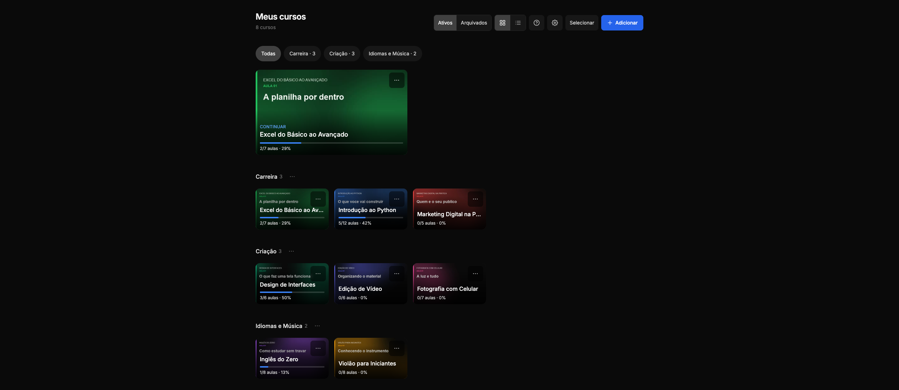
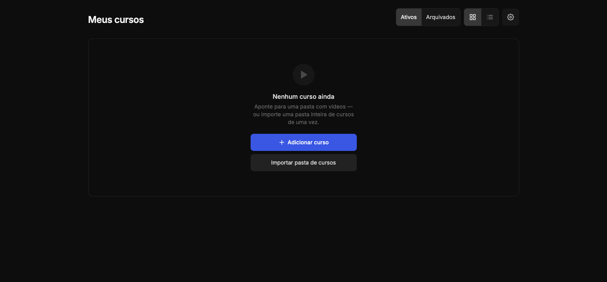
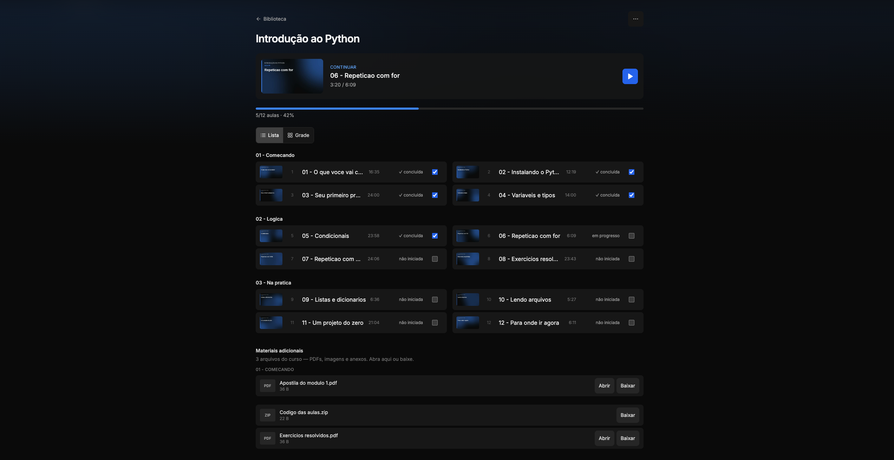

# Learnflix

Assista aos cursos em vídeo que já estão nas suas pastas, com o progresso guardado direito.

Você aponta uma pasta, ela vira um curso: o Learnflix encontra as aulas, respeita a ordem e os
módulos, gera as capas e lembra exatamente onde você parou em cada aula. Tudo roda na sua máquina —
nada é enviado para lugar nenhum, nenhuma conta, nenhum login.



---

## Como rodar

O Learnflix precisa de **uma coisa só: o Node.js 22 ou maior**. O ffmpeg é opcional — sem ele o app
funciona inteiro, só não gera as capas nem lê a duração das aulas.

Siga só a seção do seu sistema. Cada uma é completa do começo ao fim.

<br>

### 🍎 macOS

**1. Instale o Node.js** (e já o ffmpeg, de quebra). Abra o **Terminal** e cole:

```bash
brew install node ffmpeg
```

<details>
<summary>O comando falhou com <code>command not found: brew</code>?</summary>

<br>

Você ainda não tem o Homebrew. Instale-o primeiro — é uma vez só na vida da máquina:

```bash
/bin/bash -c "$(curl -fsSL https://raw.githubusercontent.com/Homebrew/install/HEAD/install.sh)"
```

Ao terminar, ele mostra um bloco **Next steps** com duas ou três linhas para você colar — cole-as,
feche e reabra o Terminal, e então rode o `brew install node ffmpeg`.

**Prefere não usar terminal para isso?** Baixe o instalador **LTS** em
[nodejs.org](https://nodejs.org) — é próximo-próximo-concluir. O ffmpeg fica para depois (ou nunca,
se você não fizer questão das capas).

</details>

**2. Baixe o Learnflix.** Aqui no GitHub: botão verde **Code → Download ZIP**. Dê dois cliques no
arquivo baixado para descompactar.

**3. Inicie.** No Terminal, digite `cd ` (com o espaço) e **arraste a pasta descompactada para dentro
da janela** — o caminho se escreve sozinho. Aperte Enter e depois:

```bash
./start.sh
```

Se aparecer `permission denied`, use `bash start.sh` — funciona igual.

<br>

### 🪟 Windows

**1. Instale o Node.js** (e já o ffmpeg). Abra o **Terminal** ou o **PowerShell** e cole:

```powershell
winget install OpenJS.NodeJS.LTS
winget install Gyan.FFmpeg
```

**Feche e reabra a janela do terminal depois.** É isso que faz o Windows enxergar o Node — pular
esse passo é o motivo nº 1 de o `start.bat` reclamar que o Node não existe.

<details>
<summary>O comando <code>winget</code> não foi reconhecido?</summary>

<br>

Seu Windows é anterior ao 10 (1809) ou está sem o *App Installer*. Baixe o instalador **LTS** direto
em [nodejs.org](https://nodejs.org) — é próximo-próximo-concluir — e, se quiser as capas, o ffmpeg em
[ffmpeg.org/download](https://ffmpeg.org/download.html).

</details>

**2. Baixe o Learnflix.** Aqui no GitHub: botão verde **Code → Download ZIP**. Clique com o botão
direito no arquivo baixado → **Extrair tudo**.

**3. Inicie.** Abra a pasta extraída e dê **dois cliques no `start.bat`**. Só isso.

<br>

### 🐧 Linux

Instale o Node 22+ pelo gerenciador da sua distro (ou pelo [nodejs.org](https://nodejs.org), se o
pacote da distro estiver defasado) e, opcionalmente, o ffmpeg. Depois, na pasta do projeto:

```bash
./start.sh
```

<br>

### Depois de iniciar

Na primeira vez o Learnflix instala as dependências e compila a interface — costuma levar menos de um
minuto. Aí o navegador abre sozinho em **`http://localhost:7777`**.

- **Nas próximas vezes** é quase instantâneo: as dependências já estão no lugar e a compilação leva
  uns 3 segundos. Se quiser pular até isso, `./start.sh fast`.
- **Para parar**, `Ctrl+C` no terminal — no Windows, basta fechar a janela.



*É isso que aparece na primeira vez: sem cadastro, sem configuração — só apontar onde estão seus cursos.*

---

## Adicionando seus cursos

**Um curso** — clique em **Adicionar curso** e navegue até a pasta dele. Cada vídeo dentro vira uma
aula; se os vídeos estiverem em subpastas, elas viram os módulos do curso. Arquivos que não são
vídeo (PDFs, slides, exercícios, código) aparecem como **materiais**, para abrir ou baixar.

**Vários de uma vez** — se você tem uma pasta com muitos cursos dentro, use **Importar em lote** e
aponte para a pasta-mãe: cada subpasta com vídeos vira um curso. O Learnflix guarda essa pasta, e
depois basta clicar em **Verificar novos cursos** para trazer o que apareceu de novo. Rodar de novo
nunca duplica nada.

A ordem das aulas segue o nome dos arquivos, com ordenação numérica de verdade — `aula 2` vem antes
de `aula 10`, e não depois.

**Nada é copiado, movido ou renomeado.** O Learnflix só lê a sua pasta; os arquivos ficam
exatamente onde estão.



*Dentro do curso: o cartão do topo leva direto ao ponto onde você parou, e os PDFs e anexos que
vieram junto ficam logo abaixo das aulas.*

---

## Bibliotecas

Cursos soltos viram bagunça rápido. Crie uma **biblioteca** (Programação, Inglês, Faculdade…) e
arraste os cursos para dentro — a tela inicial passa a mostrar cada grupo separado.

Excluir uma biblioteca **não apaga curso nenhum**: os cursos voltam para a lista geral, com todo o
progresso intacto. Biblioteca é organização, não posse.

---

## Capas e durações (ffmpeg)

O app funciona inteiro sem o ffmpeg — mas com ele instalado cada aula ganha uma miniatura e a
duração aparece na lista, o que muda bastante a cara da coisa. Se você pulou essa parte lá em cima,
dá para acrescentar a qualquer momento:

| Sistema | Como instalar |
|---|---|
| macOS | `brew install ffmpeg` |
| Windows | `winget install Gyan.FFmpeg` |
| Linux | `sudo apt install ffmpeg` (ou o gerenciador da sua distro) |

Instale, reinicie o Learnflix e as capas aparecem sozinhas nos cursos que você abrir. Você também
pode escolher outro quadro como capa do curso pelo menu ⋯.

---

## Backup e migração

O botão **↓** no topo da estante baixa um arquivo com tudo o que você construiu: os cursos, as
bibliotecas, a capa que você escolheu e o progresso de cada aula. É um `.json` pequeno — alguns
kilobytes, mesmo com dezenas de cursos — porque **os vídeos não vão junto**, só o que você fez em
cima deles.

Guarde esse arquivo onde quiser. Para trazê-lo de volta, ou levá-lo para outro computador, vá em
**Configurações → Backup e migração → Importar arquivo…**.

**A importação nunca tira nada.** Antes de confirmar, ela mostra o que vai acontecer:

```
Importar esta biblioteca?

  3 cursos novos
  2 já existem aqui — fica o progresso mais avançado dos dois,
    e aula concluída não volta atrás

              Cancelar    Importar
```

Quando a mesma aula aparece dos dois lados, vence sempre quem foi mais longe. Se você assistiu 12
minutos numa máquina e 40 na outra, ficam os 40. Aula concluída não desconclui. Importar um backup
antigo por engano não apaga nada do que você viu depois dele, e importar o mesmo arquivo duas vezes
dá no mesmo que importar uma.

**Mudar de computador funciona mesmo com os caminhos diferentes.** O Learnflix reconhece um curso
pelas aulas que ele tem, não pela pasta onde mora — então um curso que estava em `D:\Cursos\Rust` no
Windows e agora está em `/Volumes/HD/Rust` no Mac é reencontrado sozinho. E se o disco nem estiver
plugado na hora, o curso entra assim mesmo, com todo o progresso: quando você conectar o HD, use
**Re-apontar pasta…** no menu ⋯ do curso.

---

## Seus dados

Todo o progresso mora num único arquivo:

```
server/data/app.db
```

Copiar esse arquivo também é um backup válido — mais bruto que o export acima, e preso a esta
versão do app, mas serve. As miniaturas ficam em `server/data/thumbs/` e podem ser regeneradas a
qualquer momento.

O progresso não está preso ao caminho da pasta: cada aula é identificada pelo lugar dela *dentro* do
curso. Por isso, se você mover a pasta de um curso para outro disco, é só usar **Re-apontar
pasta…** no menu ⋯ do curso e apontar o novo lugar — as aulas se reencontram e nada do que você já
assistiu se perde.

---

## Atalhos de teclado

Enquanto assiste:

| Tecla | Faz |
|---|---|
| `Espaço` | Play / pausar |
| `→` / `←` | Avança / volta 10 segundos |
| `↑` / `↓` | Volume |
| `F` | Tela cheia |
| `M` | Mudo |
| `N` / `P` | Próxima / aula anterior |
| `?` | Mostra esta lista na tela |
| `Esc` | Sai da tela cheia / volta ao curso |

---

## Quando um vídeo não toca

Alguns cursos baixados trazem arquivos com a extensão errada — um `.mp4` que por dentro é MPEG-TS,
por exemplo. O navegador não toca, e o Learnflix explica o motivo em vez de mostrar uma tela preta.

Quando dá para consertar sem perda de qualidade, aparece o botão **Converter agora (sem perda)**: a
conversão leva segundos, é gravada à parte e **o arquivo original não é tocado**.

Quando o codec em si é incompatível (H.264 10-bit, HEVC), a única saída é recodificar de verdade —
lento e com perda. O Learnflix não faz isso por você: converta a aula para H.264 8-bit com o
[HandBrake](https://handbrake.fr) ou o VLC, substitua o arquivo na pasta do curso e use
**Re-escanear agora** no menu do curso. O progresso é preservado.

---

## Configuração

Tudo opcional, por variável de ambiente:

| Variável | Padrão | Para que serve |
|---|---|---|
| `PORT` | `7777` | Porta do serviço |
| `ALLOWED_ROOTS` | todo disco montado — veja abaixo | Restringe as pastas que o seletor pode navegar |
| `DATA_DIR` | `server/data` | Onde ficam o banco e as miniaturas |
| `OPEN_BROWSER` | `1` | `0` para não abrir o navegador sozinho |

**HD externo funciona sem configurar nada.** Por padrão o seletor enxerga todos os discos montados:
as unidades (`C:`, `D:`, `E:`…) no Windows, `/Volumes` no macOS, `/media` e `/mnt` no Linux, mais a
sua pasta de usuário. Plugou o HD com o app já aberto? Ele aparece — não precisa reiniciar.

`ALLOWED_ROOTS` serve para o caminho contrário: **restringir**. Definir a variável substitui a
detecção automática, útil se você roda o app num computador compartilhado e quer limitar o alcance a
uma pasta só:

```bash
PORT=8080 ALLOWED_ROOTS="/Volumes/HD-Cursos" ./start.sh
```

Você também pode acrescentar pastas-raiz pela tela de **Configurações**, sem mexer em variável
nenhuma.

---

## Desenvolvimento

Monorepo com dois workspaces: `server` (Fastify + SQLite) e `web` (React + Vite).

```bash
./start.sh dev     # Vite em :5173 com hot reload, API em :7777
npm test           # testes dos dois workspaces
npm run build      # checagem de tipos + build de produção
```

O servidor existe porque o navegador não consegue ler pastas do disco sozinho: ele lê as pastas
(sempre só-leitura), transmite o vídeo por HTTP Range para o seek funcionar, gera as miniaturas e é
dono do banco. A interface conversa com ele por uma API JSON.

O código e os comentários estão em português.

---

## Licença

MIT — use, modifique e compartilhe à vontade.
